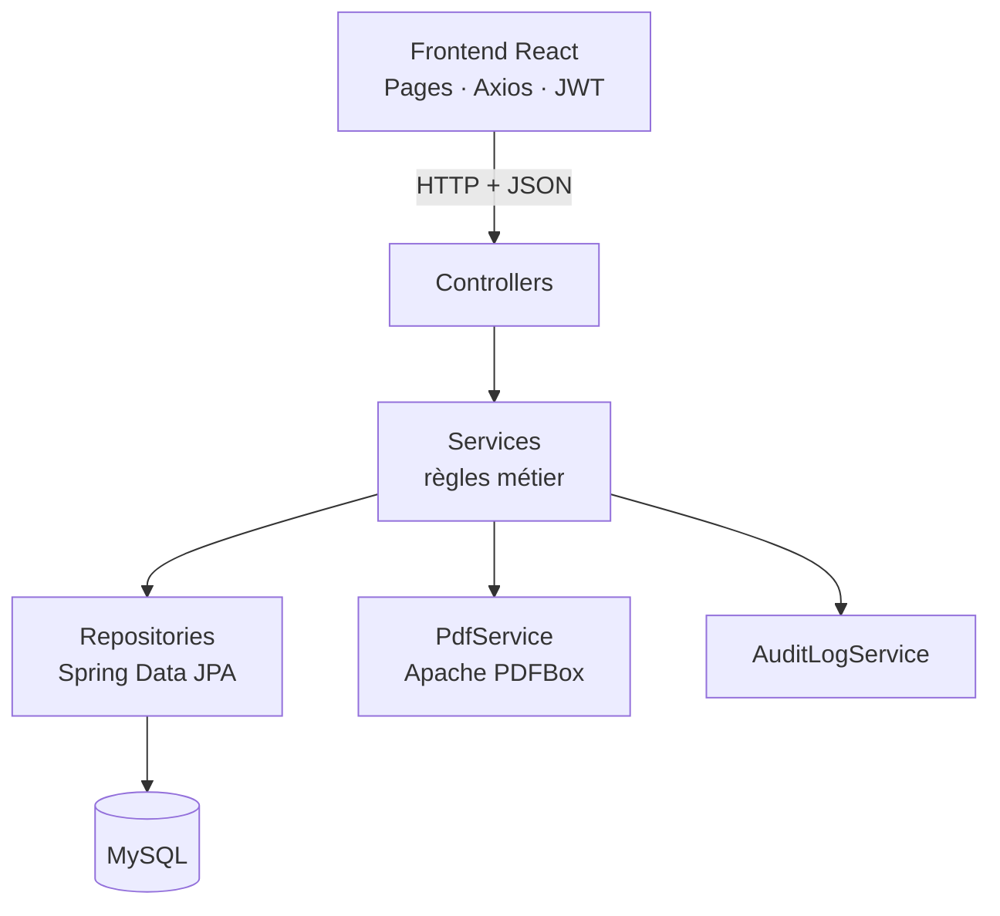
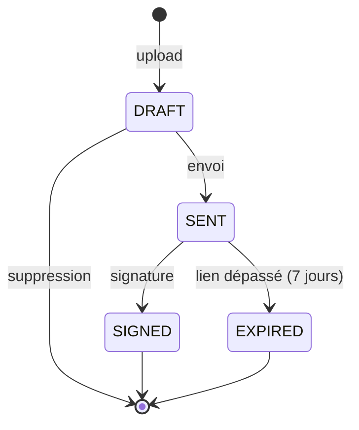

# Signix

Application web de **signature électronique de documents** destinée aux petites et moyennes entreprises : une alternative simplifiée aux solutions comme DocuSign, centrée sur l'essentiel — *envoyer, signer, tracer*.

> Projet File Rouge — Licence Professionnelle Génie Informatique, École ENNA (Béni Mellal)

| Dépôt | Contenu |
|---|---|
| [`signix_backend`](https://github.com/NihadHub/signix_backend) | API REST Spring Boot |
| [`signix_frontend`](https://github.com/NihadHub/signix_frontend) | Interface React |

---

## Sommaire

1. [Fonctionnalités](#fonctionnalités)
2. [Architecture](#architecture)
3. [Stack technique](#stack-technique)
4. [Workflow d'un document](#workflow-dun-document)
5. [Sécurité](#sécurité)
6. [Modèle de données](#modèle-de-données)
7. [API REST](#api-rest)
8. [Installation et lancement](#installation-et-lancement)
9. [Docker](#docker)
10. [Tests et qualité de code](#tests-et-qualité-de-code)
11. [Intégration continue](#intégration-continue)
12. [Choix de conception](#choix-de-conception)
13. [Perspectives d'évolution](#perspectives-dévolution)

---

## Fonctionnalités

**Propriétaire du document (utilisateur authentifié)**

- Inscription et connexion (JWT, mot de passe chiffré avec BCrypt)
- Upload d'un document PDF
- Envoi pour signature avec génération d'un lien unique
- Tableau de bord avec compteurs par statut, recherche par titre, filtre par statut et pagination
- Consultation du détail d'un document et de son historique (audit log)
- Suppression d'un brouillon, téléchargement du PDF (original ou signé)

**Signataire (invité, sans compte)**

- Accès au document via un lien contenant un token imprévisible
- Consultation du PDF avant signature
- Signature manuscrite via un canvas HTML5, avec case de consentement explicite
- Les PDF sont fusionnés avec la signature (Apache PDFBox)

**Transversal**

- Expiration du lien après 7 jours, vérifiée à la volée
- Historique horodaté de chaque action (création, envoi, consultation, signature, expiration)
- Verrouillage du document après signature

---

## Architecture



Chaque couche ne dialogue qu'avec sa voisine directe : les controllers ne connaissent jamais les repositories, et les entités JPA ne sont jamais exposées directement (conversion en DTO via MapStruct).

### Structure du backend

```
com.signix
├── config/        SecurityConfig (chaîne de filtres, CORS, BCrypt)
├── security/      JwtService, JwtAuthFilter, UserDetailsServiceImpl
├── model/         User, Document, SigningRequest, AuditLog + enums
├── repository/    interfaces Spring Data JPA
├── service/       AuthService, DocumentService, SigningRequestService,
│                  PdfService, AuditLogService
├── controller/    AuthController, DocumentController, SignController
├── dto/           objets de requête / réponse
├── mapper/        interfaces MapStruct
└── exception/     exceptions métier + GlobalExceptionHandler
```

### Structure du frontend

```
src/
├── api/           axiosConfig (intercepteurs JWT et erreurs)
├── context/       AuthContext (utilisateur connecté, login, logout)
├── components/    Sidebar, StatusBadge, SignatureCanvas, ProtectedRoute, Logo
└── pages/         Login, Register, Dashboard, Upload, DocumentDetail,
                   Sign (route publique), Expired
```

---

## Stack technique

| Domaine | Technologie |
|---|---|
| Backend | Java 21, Spring Boot 4.0.8, Spring Web, Spring Data JPA |
| Sécurité | Spring Security, JWT (jjwt 0.12.6), BCrypt |
| Base de données | MySQL 8, migrations Flyway |
| Mapping | MapStruct, Lombok |
| PDF | Apache PDFBox 3 |
| Documentation API | springdoc-openapi (Swagger UI) |
| Frontend | React, Vite, React Router, Axios |
| Tests | JUnit 5, Mockito |
| Qualité | Qodana, SonarQube |
| Déploiement | Docker, Docker Compose |
| CI | GitHub Actions |

---

## Workflow d'un document



Règles imposées côté backend (jamais uniquement côté interface) :

- Seul un document `DRAFT` peut être envoyé ou supprimé.
- Seul un document `SENT` non expiré peut être signé.
- Un document `SIGNED` est verrouillé : il ne peut plus être modifié ni signé à nouveau.
- Un utilisateur ne peut agir que sur ses propres documents.

### Flux complet

1. Le propriétaire uploade un PDF → statut `DRAFT`.
2. Il renseigne l'email du signataire et envoie → un `SigningRequest` est créé (token UUID, expiration à J+7), statut `SENT`.
3. Il copie le lien de signature (`/sign/{token}`) et le transmet lui-même au signataire.
4. Le signataire ouvre le lien, consulte le PDF, dessine sa signature et valide.
5. `PdfService` fusionne la signature dans le PDF, le statut passe à `SIGNED`.
6. Chaque étape est enregistrée dans l'audit log.

> L'envoi automatique d'email n'est volontairement pas implémenté : le lien est affiché à l'écran et transmis manuellement .

---

## Sécurité

Deux modèles de sécurité coexistent, adaptés à chaque type d'utilisateur :

| | Propriétaire | Signataire |
|---|---|---|
| Identification | Compte (email + mot de passe) | Aucun compte |
| Preuve d'accès | Token JWT | Token UUID imprévisible |
| Vérification | `JwtAuthFilter` à chaque requête | Existence du token + expiration |
| Routes | `/documents/**` (protégées) | `/sign/**` (publiques) |

Mesures complémentaires :

- Mots de passe hachés avec BCrypt, jamais stockés en clair
- Sessions stateless (aucune session serveur)
- Autorisation par propriété : vérification que le document appartient à l'utilisateur connecté
- Validation des fichiers uploadés (type PDF, nom de fichier préfixé d'un UUID)
- Secrets (`DB_PASSWORD`, `JWT_SECRET`) fournis par variables d'environnement, jamais commités
- Analyse des dépendances avec Qodana : 14 vulnérabilités transitives corrigées par mise à jour ciblée des versions

---

Le schéma est créé et versionné par **Flyway** (`src/main/resources/db/migration/V1__init_schema.sql`). Hibernate est configuré en `ddl-auto=validate` : il vérifie le schéma sans jamais le modifier.

---

## API REST

Documentation interactive : `http://localhost:8080/swagger-ui.html`

### Authentification (publique)

| Méthode | Route | Description |
|---|---|---|
| POST | `/auth/register` | Création de compte, retourne un JWT |
| POST | `/auth/login` | Connexion, retourne un JWT |

### Documents (JWT requis)

| Méthode | Route | Description |
|---|---|---|
| POST | `/documents` | Upload d'un PDF (`multipart` : `title`, `file`) |
| GET | `/documents` | Liste paginée (`title`, `status`, `page`, `size`) |
| POST | `/documents/{id}/send` | Envoi pour signature (`signerEmail`) |
| DELETE | `/documents/{id}` | Suppression (brouillon uniquement) |
| GET | `/documents/{id}/download` | Téléchargement du PDF (signé si disponible) |
| GET | `/documents/{id}/history` | Historique paginé du document |

### Signature (publique, protégée par token)

| Méthode | Route | Description |
|---|---|---|
| GET | `/sign/{token}` | Informations sur la demande de signature |
| GET | `/sign/{token}/file` | PDF à signer |
| POST | `/sign/{token}` | Enregistre la signature (`signatureImageBase64`) |

### Codes de réponse

| Code | Signification |
|---|---|
| 400 | Validation invalide ou fichier incorrect |
| 401 / 403 | Non authentifié ou accès refusé |
| 404 | Ressource introuvable |
| 409 | Conflit (email déjà utilisé, document déjà signé) |
| 410 | Lien de signature expiré |

---

## Installation et lancement

### Prérequis

- Java 21
- Maven 3.9+ (ou le wrapper `mvnw` fourni)
- MySQL 8
- Node.js 20+

### 1. Backend

```bash
git clone https://github.com/NihadHub/signix_backend.git
cd signix_backend
```

Définir les variables d'environnement :

| Variable | Description |
|---|---|
| `DB_PASSWORD` | Mot de passe MySQL (utilisateur `root`) |
| `JWT_SECRET` | Clé de signature des JWT (32 caractères minimum) |

Lancer l'application :

```bash
./mvnw spring-boot:run
```

Au démarrage, Flyway crée automatiquement le schéma. L'API est disponible sur `http://localhost:8080`.

Paramètres métier (`application.properties`) :

| Propriété | Valeur par défaut | Rôle |
|---|---|---|
| `app.signing.expiration-days` | `7` | Durée de validité d'un lien de signature |
| `app.upload.dir` | `uploads/documents` | Dossier de stockage des PDF |
| `jwt.expiration` | `86400000` | Durée de vie d'un JWT (24 h) |
| `spring.servlet.multipart.max-file-size` | `10MB` | Taille maximale d'un upload |

### 2. Frontend

```bash
git clone https://github.com/NihadHub/signix_frontend.git
cd signix_frontend
npm install
npm run dev
```

L'interface est disponible sur `http://localhost:5173`. L'origine autorisée par le CORS du backend est `http://localhost:5173`.

---

## Docker

Créer un fichier `.env` à côté du `docker-compose.yml` (jamais commité) :

```
DB_PASSWORD=votre_mot_de_passe
JWT_SECRET=une_cle_secrete_longue_et_aleatoire
```

Lancer l'ensemble de la stack :

```bash
docker-compose up --build
```

| Service | Rôle | Port |
|---|---|---|
| `mysql` | Base de données (volume persistant) | 3306 |
| `backend` | API Spring Boot (build multi-stage) | 8080 |
| `frontend` | React servi par Nginx | 5173 |

Commandes utiles :

```bash
docker-compose up --build -d     # lancement en arrière-plan
docker-compose logs -f backend   # suivi des logs
docker-compose down              # arrêt (données conservées)
docker-compose down -v           # arrêt + suppression des volumes
```

---

## Tests et qualité de code

### Tests unitaires

```bash
./mvnw test
```

Les tests JUnit 5 / Mockito couvrent les règles métier critiques :

- **AuthService** : inscription, email déjà utilisé, connexion
- **DocumentService** : upload, envoi, refus si statut invalide ou mauvais propriétaire, suppression d'un brouillon
- **SigningRequestService** : signature réussie, document déjà signé, lien expiré

### Analyse statique

- **Qodana** (JetBrains) : détection des vulnérabilités de dépendances. Passage de 14 alertes à 0 après mise à jour ciblée (Spring Boot 4.0.8, Jackson).

sonar.host.url=http://localhost:9000 -Dsonar.token=VOTRE_TOKEN
```

---

## Intégration continue

Deux pipelines GitHub Actions indépendants (un par dépôt), déclenchés à chaque push et pull request sur `main` :

| Dépôt | Étapes |
|---|---|
| `signix_backend` | JDK 21 → base MySQL éphémère → `mvn clean verify` (build + tests) |
| `signix_frontend` | Node 20 → `npm install` → `npm run build` |

---

## Choix de conception

- **Pourquoi une entité `SigningRequest` séparée ?** Elle porte le processus de signature (token, expiration, image de signature) avec son propre cycle de vie, tandis que `Document` représente le fichier et son état.
- **Expiration à la volée plutôt qu'un scheduler.** Le premier accès après l'échéance déclenche la transition vers `EXPIRED`, ce qui évite toute tâche planifiée à maintenir et à tester.
- **`actor` en simple chaîne dans `AuditLog`.** Le signataire n'a pas de compte : l'audit doit pouvoir enregistrer des actions d'acteurs absents de la table `user` (email du signataire, `SYSTEM`).
- **DTO et MapStruct.** Les entités ne sont jamais exposées : aucun risque de fuite du mot de passe et découplage entre le schéma de base et l'API.
- **Un seul rôle (`USER`).** Un simple contrôle d'authentification suffit : aucune page n'est réservée à un sous-ensemble d'utilisateurs connectés.
- **Flyway avec `ddl-auto=validate`.** Le schéma est versionné et reproductible, indispensable pour un déploiement Docker fiable.

---

## Perspectives d'évolution

- Envoi réel d'emails de notification au signataire
- Signature par plusieurs signataires successifs
- Rôle administrateur pour la supervision
- Positionnement de la signature choisi par l'utilisateur sur le document
- Application mobile

